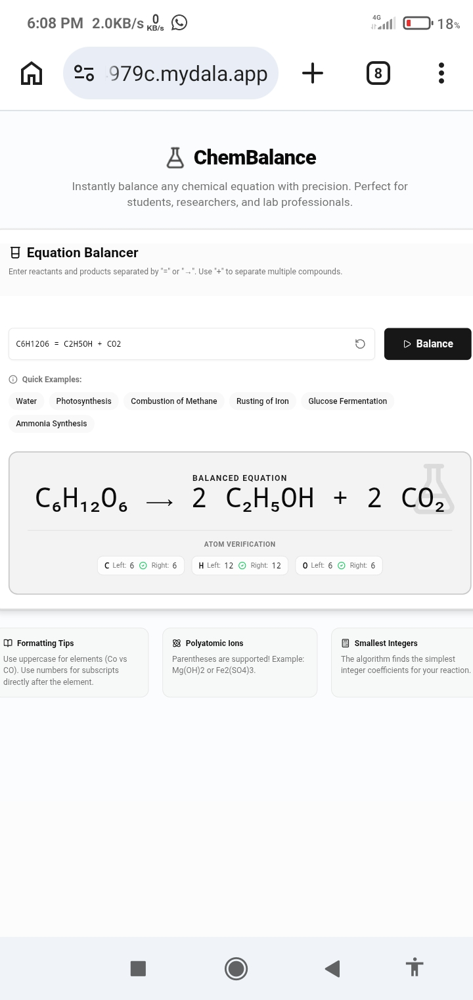
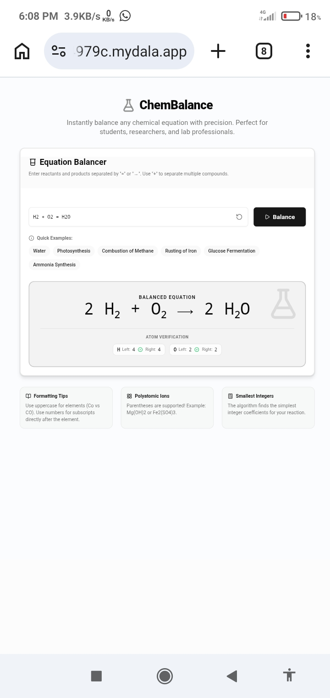
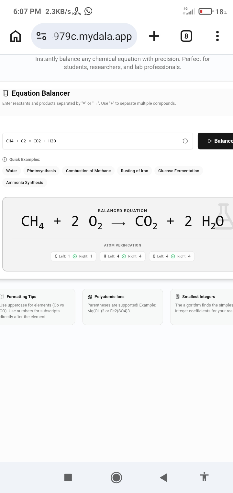
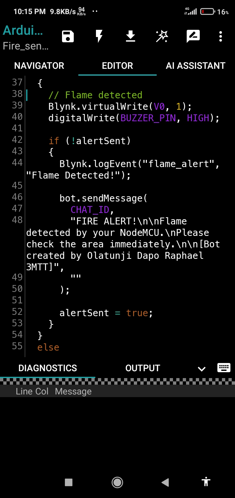
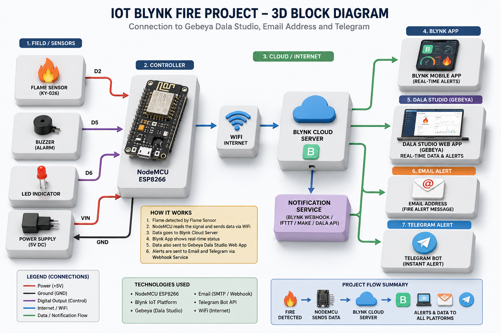

# 3MTT-NEXTGEN-Knowledge-Showcase
A suite of Apps-watch out for my iot apps loading ....
The very First app that I made when 3MTT made public the Dala studio was the Chemical balancer app that is used for balancing chemical equations ,it can balance very hard chemical equations for Chemistry students and teachers also find the app useful,the app is deployed at https://cb24979c.mydala.app

The other app that I made was a tracking app that can track anything , including Kidnappers, including stolen cars and phone ,the app made by dala studio stores and send the location of a kidnapped person, stolen car or phone automatically to a configured telegram account.In this way the person kidnapped ,stolen phone and cars can be recovered.
# Take note, immediate actions must be taken, once the alert has been received via the telegram  bot when  a person has been kidnapped or a car or phone has been stolen.I deployed the tracking app at Kidnappers tracker app 1  -https://5d7eca83.mydala.app kidnappers tracker app 2- https://57aa1746.mydala.app
# The third app that I made from dala studio was the IOT fire alarm project.
This app made from Dala studio is the best thing since sliced bread.In this project I married electronics with coding
# Materials /Software used for the project.
1.Fire sensor 2.ESP8266  Nodemcu Controller with Wi-Fi 3.Bread board 4.Jumper wires 5.Arduino droid 6.Type C cord 7.Lighter that serves as the source of the fire . 8 Blynk cloud server 9.Dala studio 
# Mechhanism of operation 
The lighter serves as the source of the Fire ,when the fire is released by the lighter ,the fire sensor pick out the fire as a signal ,and send it to the Esp node mcu controller that the Wi-Fi has connected to the hotspot of my phone or any hotspot that has a working Internet data.The controller sends the fire signal to the blynk cloud server ,this servers later send the fire signal to the telegram bot,email address, blynk app and Dala studio web app and the alert is received immediately.The good thing about this project is that since it's an IoT it means the fire alert can be received ANY WHERE IN THE WORLD 🌎 🌎.
If someone is living in USA and his house in Nigeria is burning ,he will get the alert automatically and instantly in USA.
# The app is useful for security men at night because most fire out break at market usually occurs at night and since one security man cannot be in many places at the same time ,this app will sense any fire at any place in a market.Once  the alert is received,they will be able to swing into action immediately in order to put out the fire .
The iot fire sensor app is deployed at 
https://36fef3c2.mydala.app/

# The fourth app that I made is for satellite tv installers ,of which I am also an installer 
The app is deployed at https://6bacecb0.mydala.app

